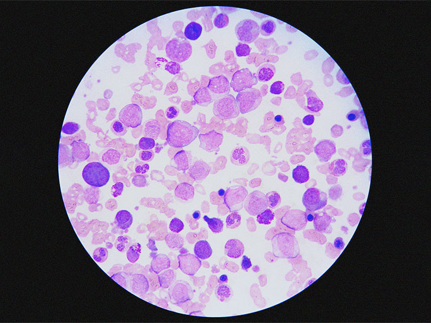

# Leukemia-classifier

Leukemia classifier is build for Identify cancer cells in the most prevalent childhood cancer type.

**INTRODUCTION** 

Leukemia is very aggressive type of cancer. 
"In USA #FACT The age-adjusted incidence rate of leukemia and lymphoma in children and adolescents younger than 20 years is 7.3 per 100,000 (leukemia, 4.7 and lymphoma, 2.6)”. Acute lymphoblastic leukemia (ALL) is the most common type of childhood cancer and accounts for approximately 25% of the pediatric cancers.
Leukemia classifier takes microscopic images of normal cells and identify immature leukemic blasts from normal cells under the microscope is challenging due to morphological similarity.

**DISCLAIMER**

This project is only for Research Purposes. This classifier is a uses Dataset from Kaggle. 
This Project is based on Python as a main language. We are using Keras, Tensorflow and Convolutional Neural Network to develop this classifier.

Dataset :- https://www.kaggle.com/andrewmvd/leukemia-classification
  
**Reference**

https://www.lls.org/facts-and-statistics/childhood-and-adolescent-blood-cancer-facts-and-statistics

https://wiki.cancerimagingarchive.net/pages/viewpage.action?pageId=52758223#52758223171ba531fc374829b21d3647e95f532c
